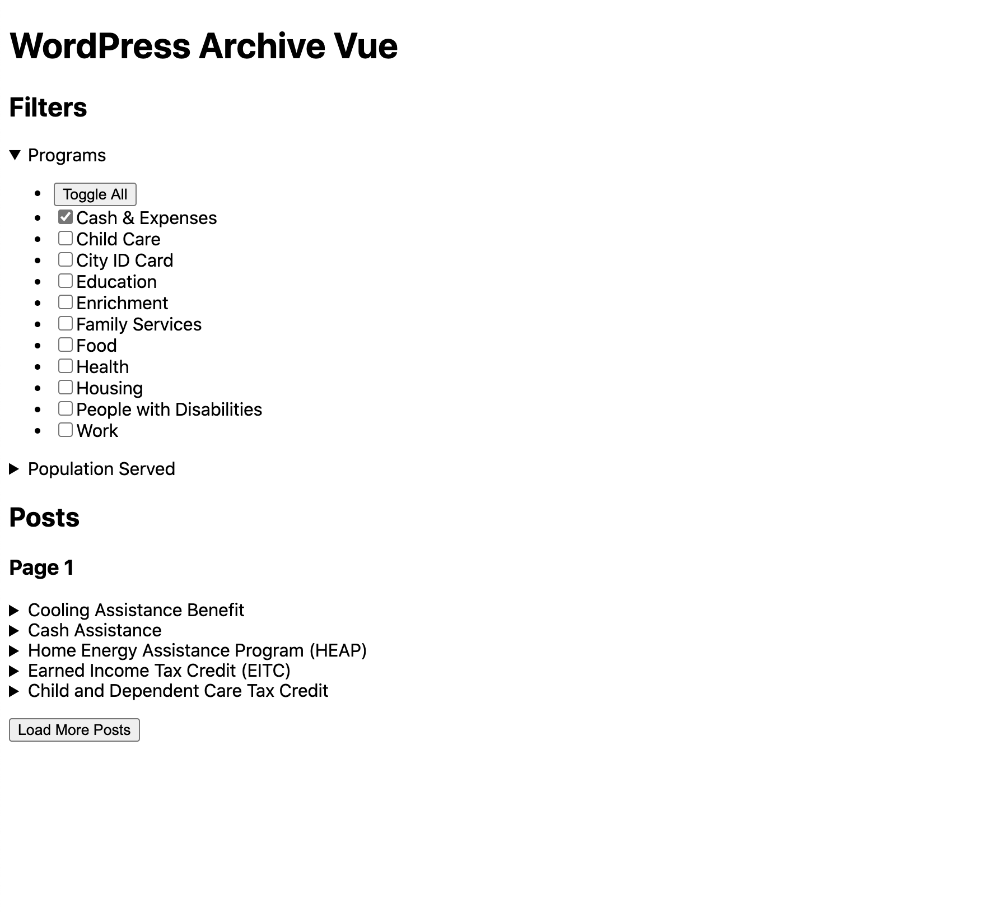

# WordPress Archive Vue

This [Vue.js](https://vuejs.org/) app creates a reactive interface for a WordPress archive for any post type (including custom post types). It provides most of the functionality (clickable post taxonomy filters, window location history support, "show more" pagination, and predefined methods and computed properties listed below) while allowing designers and developers to use their own HTML templates, scripts, and stylesheets. Live demonstrations can be seen on [access.nyc.gov/programs](https://access.nyc.gov/programs) and [working.nyc.gov/programs](https://working.nyc.gov/programs).

The app is intended to be installed via NPM and extended by a parent Vue.js application. You can configure with your own HTML template, scripts, and stylesheets. Usage details are described below.

## Details

* The application requires Vue.js `^2.6.12`

* It uses the browser's history and URL search parameters to build a fetch query for the [WordPress REST API](https://developer.wordpress.org/rest-api/) for retrieving taxonomy, term, and post data.

* It supports multilingual sites using [WPML](https://wpml.org/) configured with ["languages in directory" settings](https://wpml.org/documentation/getting-started-guide/language-setup/language-url-options/#different-languages-in-directories).

* Examples can be seen on [ACCESS NYC](https://github.com/CityOfNewYork/ACCESS-NYC) and [Working NYC](https://github.com/CityOfNewYork/ACCESS-NYC). The source code can be inspected in their respective repositories.


## Usage

### Install

Install this dependency in your theme:

```shell
npm install @nycopportunity/wp-archive-vue
```

The example notably uses the [Vue.js createElement](https://vuejs.org/v2/guide/render-function.html#createElement-Arguments) method and pre-rendering features to avoid the use of unsafe `eval()` method (creating code from strings) by the application. However, this implementation method is optional and it can be mounted to a Vue instance in a more traditional fashion.

### Register a REST route for terms

It is recommended to [register a new REST route](https://developer.wordpress.org/reference/functions/register_rest_route/) in your WordPress site that will return the taxonomy and terms data for the post type that will be queried. This example uses the [Transients API](https://developer.wordpress.org/apis/handbook/transients/) to cache requests results for performance. It also provides options for specifying the post type, empty term, and cache handling. This snippet can be dropped in as a single file (**register-rest-routes.php**) in the "must use" plugin directory.

Once the below route is registered the terms can be viewed or queried at `/wp-json/api/v1/terms/?post_type[]=post&cache=0`.

**Note**. It is also suitable and possible to provide term filters using server-side templates. A static JSON object can be supplied and mounted to the application at runtime.

```php
<?php

/**
 * Plugin Name: Register REST Routes
 * Description: Registers custom WordPress REST API routes
 */

/**
 * Register REST Route shouldn't be done before the REST api init hook so we
 * will hook into that action.
 */
add_action('rest_api_init', function() {
  /**
   * Configuration
   */

  $v = 'api/v1'; // namespace for the current version of the API

  $exp = WEEK_IN_SECONDS; // expiration of the transient caches

  /**
   * Returns a list of public taxonomies and their terms. The argument post_type[]=
   * can be uses to get registered taxonomies for a particular post type. Multiple
   * post types can be combined.
   *
   * @param   String  $namespace  Namespace for the route
   * @param   String  $route      Endpoint for the route
   * @param   Array               An array including REST methods and
   *                              a function that processes the request
   *
   * @return  Object              A WordPress REST Response
   */
  register_rest_route('api/v1', '/terms/', array(
    'methods' => 'GET',
    'permission_callback' => '__return_true',

    /**
     * Callback for the terms endpoint.
     *
     * @param   WP_REST_Request  $request    Instance WP REST Request
     *
     * Acceptable REST parameters
     *
     * @param   Array            post_type   The desired post type or types
     * @param   Boolean          hide_empty
     * @param   Boolean          cache       Wether to use transient cache results
     *
     * @return  Array                        Array of taxonomies and their terms
     */
    'callback' => function(WP_REST_Request $request) {
      $params = $request->get_params();

      /**
       * Query Parameter Options
       */

      // What post type terms to query
      $postTypes = (isset($params['post_type'])) ?
        $params['post_type'] : false;

      // Wether to hide terms with no posts
      $hideEmpty = (isset($params['hide_empty'])) ?
        filter_var($params['hide_empty'], FILTER_VALIDATE_BOOLEAN) : false;

      // Wether to use cached terms
      $cache = (isset($params['cache'])) ?
        filter_var($params['cache'], FILTER_VALIDATE_BOOLEAN) : true;

      /**
       * Process query params
       */

      $type = ($postTypes) ? implode('_', $postTypes) : '';

      $empty = ($hideEmpty) ? $hideEmpty : '';

      $lang = (defined('ICL_LANGUAGE_CODE')) ? ICL_LANGUAGE_CODE : '';

      $key = implode('_', ['rest_terms_json', $type, $empty, $lang]);

      $data = ($cache) ? get_transient($key) : false;

      if (false === $data) {
        $data = [];

        $query = array(
          'public' => true,
          '_builtin' => false
        );

        // Get public taxonomies and build our initial assoc. array
        foreach (get_taxonomies($query, 'objects') as $tax) {
          if ($type != '' && 0 === count(array_intersect($postTypes, $tax->object_type))) {
            continue;
          }

          $data[] = array(
            'taxonomy' => $tax,
            'terms' => []
          );
        }

        // Get the terms for each taxonomy
        $data = array_map(function($tax) use ($postTypes, $hideEmpty) {
          // Get used terms limited to the post type, requires
          // a work around by getting all the posts.
          if ($postTypes) {
            foreach ($postTypes as $postType) {
              $posts = get_posts(array(
                'fields' => 'ids',
                'post_type' => $postType,
                'posts_per_page' => -1,
              ));

              $tax['terms'] = wp_get_object_terms($posts, $tax['taxonomy']->name, ['ids']);
            }
          // Get all terms regardless of post type or count.
          } else {
            $tax['terms'] = get_terms(array(
              'taxonomy' => $tax['taxonomy']->name,
              'hide_empty' => $hideEmpty
            ));
          }

          return $tax;
        }, $data);

        if ($cache) {
          set_transient($key, $data, WEEK_IN_SECONDS);
        }
      }

      $response = new WP_REST_Response($data); // Create the response object

      $response->set_status(200); // Add a custom status code

      return $response;
    }
  ));
});
```

### Configure the Front-end Component

This front-end example uses three files that are imported using the following hierarchy. It is not necessary to set them up this way, however, this is how the templates are organized for ACCESS NYC and Working NYC.

```
📄 main.js
└ 📄 programs-archive.vue
  └ 📄 programs-archive.js
```

#### Filename: **programs-archive.js**

This is the application component logic that extends the archive app, enabling you to pass your desired configuration to the app.

```javascript
import Archive from '@nycopportunity/wp-archive-vue/src/archive.vue';

export default {
  extends: Archive, // Extend the Archive app here
  data: function() {
    return {
      /**
       * This is our custom post type to query
       *
       * @type {String}
       */
      type: 'programs',

      /**
       * This is the endpoint list for terms and post requests
       *
       * @type  {Object}
       *
       * @param {String} terms     A required endpoint for the list of filters
       * @param {String} programs  This is based on the 'type' setting above
       */
      endpoints: {
        terms: '/wp-json/api/v1/terms?post_type[]=programs' + ((process.env.NODE_ENV === 'development') ? '&cache=0' : ''),
        programs: '/wp-json/wp/v2/programs'
      },

      /**
       * Each endpoint above will access a map to take the data from the request
       * and transform it for the app's display purposes
       *
       * @type   {Function}
       *
       * @return {Object}    Object with a mapping function for each endpoint
       */
      maps: function() {
        return {
          programs: p => p,

          /**
           * Terms Map
           */
          terms: terms => ({
            name: terms.labels.archives,
            slug: terms.name,
            filters: terms.terms.map(filters => ({
              id: filters.term_id,
              name: filters.name,
              slug: filters.slug,
              parent: terms.name,
              active: (
                this.query.hasOwnProperty(terms.name) &&
                this.query[terms.name].includes(filters.term_id)
              ),
              checked: (
                this.query.hasOwnProperty(terms.name) &&
                this.query[terms.name].includes(filters.term_id)
              )
            }))
          })
        };
      }
    };
  }

  /**
   * The created hook starts the application
   *
   * @url https://vuejs.org/v2/api/#created
   *
   * @type {Function}
   */
  created: function() {
    // Add custom taxonomy queries to the list of safe params
    ['programs', 'populations-served'].map(p => {
      this.params.push(p);
    });

    // Initialize the application
    this.getState()       // Get window.location.search (filter history)
      .queue()            // Initialize the first page request
      .fetch('terms')     // Get the terms from the 'terms' endpoint
      .catch(this.error);
  }
};
```

#### Configuration

**Data Properties**

Configuration is done through via the following data properties.

Property    | Required     | Description
------------|--------------|-
`type`      | *no*         | The post type endpoint to query. Defaults to `posts`.
`endpoints` | *no*         | Object containing the `posts` and `terms` endpoints. The key for `posts` should match the `type` property.
`domain`    | *no*         | The root domain of the endpoints to query. Only needed if the app will be making cross-origin requests.
`maps`      | **yes**      | A function that contains the data maps for `posts` and `terms` responses. Described below.

The `maps` function allows you to transform the data in the response from the api and map it to your custom Vue.js template or components. It is also possible to pass the raw data, but a map function must be present for each endpoint defined in the `endpoints` data property even if it just returns the same data.

* The {{ endpoint }} key should match the endpoint defined in the endpoints data property
* A single {{ data }} point from the WP REST query is passed to the mapping function at a time
* The returned object {} is wrapped in a grouping operator () to execute scripts on the returned object
* Set your component attributes with data properties from the WP REST response attributes

```javascript
maps: function() {
  return {
    // Example mapping function
    {{ endpoint }}: {{ data }} => ({
      {{ your component attribute }}: {{ data }}.{{ WP REST response attribute }}
    }),

    // A more complete example for the terms endpoint data
    terms: terms => ({
      name: terms.labels.archives,
      slug: terms.name,
      filters: terms.terms.map(filters => ({
        id: filters.term_id,
        slug: filters.slug,
        parent: terms.name
      }))
    })
  };
}
```

**Hooks**

The `created` hook is required to initialize the application. At a minimum the following block is required create the initial request to the terms object.

```javascript
this.getState()       // Get window.location.search (filter history)
  .queue()            // Initialize the first page request
  .fetch('terms')     // Get the terms from the 'terms' endpoint
  .catch(this.error);
```

### Create a view template

This is where the reactive DOM for your view is added.

#### Filename: **programs-archive.vue**

```vue
<template>
<main>
  <h1>WordPress Archive Vue</h1>

  <aside>
    <h2>Filters</h2>

    <details v-for='term in terms' :key='term.term_id'>
      <summary>{{ term.name }}</summary>

      <ul>
        <li v-for='filter in term.filters' :key='filter.slug'>
          <label class='checkbox'>
            <input type='checkbox' :value='filter.slug' :checked='filter.checked' @change='change({event: $event, data: filter})' />

            <span v-html='filter.name'>{{ filter.name }}</span>
          </label>
        </li>
      </ul>
    </details>
  </aside>

  <article>
    <h2>Posts</h2>

    <div v-for='page in posts' :key='`page-${posts.indexOf(page)}`'>
      <div v-if='page && page.show'>
        <h3>Page {{ posts.indexOf(page) }}</h3>

        <details v-for='post in page.posts' :key='post.id'>
          <summary v-html='post.title.rendered'>
            {{ post.title.rendered }}
          </summary>

          <pre>{{ post }}</pre>
        </details>
      </div>
    </div>

    <p>
      <button @click='paginate' v-if='next' data-amount='1'>
        Load More Posts
      </button>
    </p>
  </article>
</main>
</template>

<script>
  import ProgramsArchive from 'programs-archive.js';
  export default ProgramsArchive;
</script>
```

In this example, you can see how the logic for the application above is imported into the view template via the `<script>` tag. However, in normal single file components they would be combined.

#### Data

There are two main data objects in the app that are used to display archive results; `terms` and `posts`. The app will query the REST api to retrieve the initial data. Each time a request is made and a response is returned, the data is passed through a mapping function that can be used to customize what is passed to your app or to custom Vue.js components. The example above includes a mapping function for `terms`.

Data    | Description
--------|-
`terms` | An array of WordPress taxonomy objects with nested term objects for each.
`posts` | An array of queried posts organized by page number.

#### Computed Properties

There are several computed properties that can be used in your application to create loading mechanisms and show pagination.

Properties     | Description
---------------|-
`filtering`    | Wether posts are currently being filtered.
`lang`         | The language of the document (and query).
`loading`      | Wether there are no posts to show but a query is being made.
`next`         | Wether there is another page with posts to display.
`none`         | Wether there posts to display from the modified query.
`previous`     | Wether there is a previous page with posts to display.
`postsFlat`    | By default the application returns paged results, this adds all visible posts to a single array.
`totalVisible` | Find the total visible posts.
`totalFilters` | Returns the total number of checked filters.

#### Methods

The following methods are available to the view template to use.

##### `click`

The `click` method is the primary method included in the app that will invoke requests for new posts to be added to the archive. It accepts an object as an argument with the click event (`event`) an the term object (`data`). The only required properties to include in the term object are the taxonomy slug (`parent`) and the numerical ID of the WordPress taxonomy term (`id`).

It can be added to the `@change` event for input elements such as checkboxes or the `@click` event for hyperlinks or buttons. The filter's checked property will be bound to the checked attribute of the filter.

```javascript
this.click({
  event: $event
  data: {
    parent: 'parent' // {String} Slug of the taxonomy
    id: 154          // {Number} ID of the taxonomy term object
  }
});
```

**Example usage**

```html
<input type="checkbox" :value="filter.slug" :checked="filter.checked" @change="click({event: $event, data: filter})" />
```

##### `toggle`

The `toggle` method will change the state of all the filters to `checked: true`. If clicked again, it will toggle them to `checked: false`. The main object argument for this method is similar to the `click` method, however, the only attribute that is required for the data object (`data`) is the taxonomy slug (`parent`).

It can be added to the `@click` event of a button.

```javascript
this.toggle({
  event: $event
  data: {
    parent: 'parent' // {String} Slug of the taxonomy
    // ...
  }
});
```

**Example usage**

```html
<button type="button" @click="toggle({event: $event, data: {parent: term.slug}})">Toggle all</button>
```

##### `reset`

This method will clear set all filters in all taxonomies off.

**Example usage**

```html
<button type="button" @click="reset">Clear filters</button>
```

##### `nextPage`

The `nextPage` method will show the next page of results. The amount of pages can be set buy the `data-amount` attribute. This button can be conditionally hidden using the `next` computed property.

**Example usage**

```html
<button @click="nextPage" v-if="next" data-amount="1">Show more</button>
```

### Import and mount the app

Finally, import the application and mount it to your main application. The method below uses the `createElement` function because the `ProgramsArchive` application will be pre-rendered when imported.

#### Filename: **main.js**

```javascript
import Vue from 'vue/dist/vue.runtime.min';
import ProgramsArchive from 'programs-archive.vue';

new Vue({
  render: createElement => createElement(ProgramsArchive)
}).$mount('[data-js="programs"]');
```

```
📄 main.js
└ 📄 programs-archive.vue
  └ 📄 programs-archive.js
```

## Contributing

This module uses the [Vue.js CLI](https://cli.vuejs.org/) to run a simple application using a WordPress installation running on `localhost:8080`. Clone the repository and run `npm start` to start the application.

```shell
git clone https://github.com/CityOfNewYork/nyco-wp-archive-vue.git
```

```shell
cd nyco-wp-archive-vue
```

```shell
npm install
```

```shell
npm start
```

**Output**

```shell
> @nycopportunity/wp-archive-vue@1.1.3 start /nyco-wp-archive-vue
> vue serve proto/app.vue

INFO  Starting development server...
98% after emitting

DONE  Compiled successfully in 5208ms

  App running at:
  - Local:   http://localhost:8082/
  - Network: http://192.168.1.33:8082/

  Note that the development build is not optimized.
  To create a production build, run npm run build.
```

**http://localhost:8082/**

The application pictured in the screenshot below is querying a local installation of the [ACCESS NYC](https://github.com/CityOfNewYork/ACCESS-NYC) WordPress REST API.



---


[The Mayor's Office for Economic Opportunity](http://nyc.gov/opportunity) (NYC Opportunity) is committed to sharing open source software that we use in our products. Feel free to ask questions and share feedback. **Interested in contributing?** See our open positions on [buildwithnyc.github.io](http://buildwithnyc.github.io/). Follow our team on [Github](https://github.com/orgs/CityOfNewYork/teams/nycopportunity) (if you are part of the [@cityofnewyork](https://github.com/CityOfNewYork/) organization) or [browse our work on Github](https://github.com/search?q=nycopportunity).
